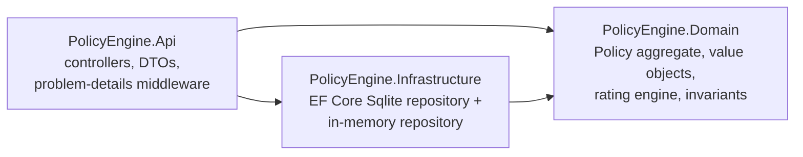

# PolicyEngine

[](https://github.com/MarvinNesh/policy-engine-api/actions/workflows/ci.yml)

A policy administration REST API built with **C# / .NET 8**, modelling the full
short-term insurance policy lifecycle: **quote → bind → mid-term adjustment →
cancellation / renewal**, with pro-rata premium arithmetic handled in a
domain-driven core.

I built this to explore how insurance platforms model the policy lifecycle,
and to demonstrate production-style .NET backend design: rich domain models,
Entity Framework Core persistence, OpenAPI documentation, and a CI-verified
xUnit test suite.

## What it does

| Capability | Endpoint | Behaviour |
|---|---|---|
| Quote & rate | `POST /api/quotes` | Table-driven rating engine: base rate per product, age loadings, minimum premium |
| Bind | `POST /api/quotes/{id}/bind` | Allocates a policy number and puts the policy on risk |
| Mid-term adjustment | `POST /api/policies/{id}/adjustments` | Re-rates the risk and charges/refunds the premium delta **pro rata** for remaining days |
| Cancel | `POST /api/policies/{id}/cancel` | Computes the pro-rata refund of unused premium |
| Renew | `POST /api/policies/{id}/renew` | Expires the current term and issues a follow-on annual term at current rates |
| Query | `GET /api/policies?status=Active` | List/filter policies, full endorsement history per policy |

Interactive documentation is served at `/swagger`.

## Architecture



* **`PolicyEngine.Domain`** has zero dependencies. The `Policy` aggregate owns
  every state transition, so an invalid lifecycle move (e.g. adjusting a quote,
  cancelling twice) is impossible by construction and surfaces as a
  `DomainException` → HTTP `422` with RFC 7807 problem details.
* **Value objects** (`Money`, `PolicyTerm`) centralise rounding rules
  (2 dp, away from zero) and day-count arithmetic, so pro-rata maths lives in
  one place and is unit-tested in isolation.
* **`IPolicyRepository`** decouples the domain from persistence. Two
  implementations ship: **EF Core + SQLite** (default) and a thread-safe
  **in-memory** store (set `"Persistence": "InMemory"`) used for frictionless
  local runs and as a test double.
* **Rating engine** (`IPremiumCalculator`) is a swappable domain service, so
  pricing rules can evolve (or be A/B tested) without touching the aggregate.

## Getting started

```bash
git clone https://github.com/MarvinNesh/policy-engine-api.git
cd policy-engine-api
dotnet test          # run the unit test suite
dotnet run --project src/PolicyEngine.Api
# open http://localhost:5000/swagger (port may vary; see console output)
```

### Sample session

```bash
# 1. Get a quote for motor cover
curl -s -X POST http://localhost:5000/api/quotes \
  -H "Content-Type: application/json" \
  -d '{"holderName":"Thandi Mokoena","holderAge":35,"product":"Motor","sumInsured":200000,"coverStart":"2026-01-01"}'
# -> annual premium ZAR 9 000.00, status "Quoted"

# 2. Bind it
curl -s -X POST http://localhost:5000/api/quotes/{id}/bind
# -> policy number POL-… , status "Active"

# 3. Increase cover mid-term (pro-rata additional premium is calculated)
curl -s -X POST http://localhost:5000/api/policies/{id}/adjustments \
  -H "Content-Type: application/json" \
  -d '{"newSumInsured":300000,"effectiveDate":"2026-07-01"}'

# 4. Cancel (pro-rata refund is calculated)
curl -s -X POST http://localhost:5000/api/policies/{id}/cancel \
  -H "Content-Type: application/json" \
  -d '{"effectiveDate":"2026-09-01"}'
```

## Design decisions

* **Why a rich domain model?** Policy administration is invariant-heavy
  (lifecycle order, term boundaries, premium arithmetic). Pushing those rules
  into the aggregate keeps controllers thin and makes the rules directly
  unit-testable without HTTP or a database.
* **Why pro-rata on a day-count basis?** It matches how short-term insurers
  actually charge and refund: `delta = (new annual − old annual) × remaining
  days ÷ term days`. The rounding policy is owned by the `Money` value object.
* **Why SQLite?** Zero-setup reviewer experience; the EF Core model
  (complex types for value objects, owned collection for endorsements) ports
  directly to SQL Server or PostgreSQL by swapping the provider.
* **Why an in-memory persistence mode?** Fast tests and a one-command demo,
  while proving the domain is persistence-agnostic behind `IPolicyRepository`.

## Test suite

`dotnet test` covers the rating engine (base rates, loadings, minimum premium),
lifecycle invariants (illegal transitions throw), and pro-rata arithmetic
(mid-term increases/decreases, cancellation refunds, boundary dates).

## Roadmap

* Claims registration against active policies
* Idempotency keys on state-changing endpoints
* Multi-currency rating tables
* Dockerfile + container-based integration tests

## Licence

MIT
